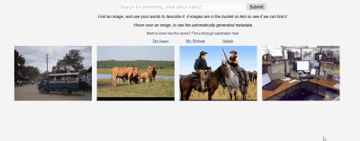

# Content-based Deep Image-Search for Context-Sensitive Conversational Langauge

Search images by describing them with conversational language, supporting both context _and_ object similarity.

## Links

[Essay](#)

[My Website](https://frederikgram.github.io/)
