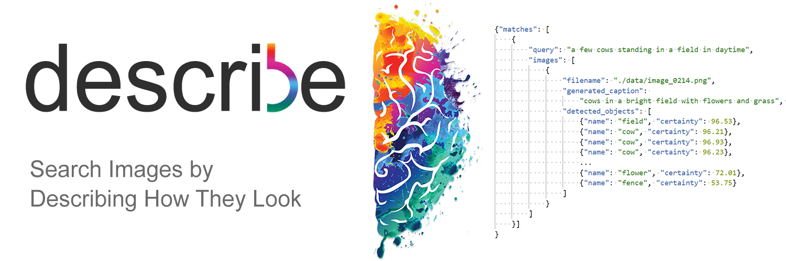

# About

Search images by describing their appearance using
conversational language, supporting both context
_and_ object similarity.

No pre-made metadata required! Everything is 
analyzed and stored _on-the-fly_.

# How does it work?
Every image added to the ```./static/images/``` folder is analysed using a pipeline of:
- Object Detection (YOLOv3)
- Caption Generation (CNN -> RNN)

When the user is searching, we perform the
following process on the input query.
- Query Processing (Tokenizing, Word2Vec etc.)
- Similarity Analysis
  - TFID Similaity (Query and Caption),
  - Object-by-Object Similarity (Word2Vec Encoded) 

After this, we can get an ensemble prediction using the weighted mean of object certainties\
combined with the TFIDSimilarity result for how well it matches the given search query.

## Links
[My Website](https://frederikgram.github.io/) and 
[My LinkedIn](https://www.linkedin.com/in/frederikgramkortegaard/).
## Running the service
Currently, the service is not in a state where it can easily be deployed. A complete docker-solution is in development. A demo of the searching process can be seen [here](./demos/search_demo.gif) (the GUI is purely for showcase purposes and does not reflect any real product design).
