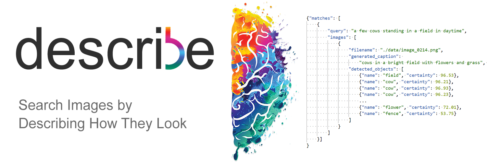

**not yet implemented**

:bookmark: [Fast forward to the model evaluations](./models.md)

:bookmark: [Fast forward to the interactive demo](#)

:bookmark: [Go to API Documentation](#)


# About

Search images by describing their appearance using
conversational language. Without lemmatization and with support for both in-image objects similarity and word2vec encodings to accept small variations in your memory of images.

No pre-made metadata required! Everything is 
analyzed and stored _on-the-fly_.

## How does it work?
Every image added to the ```./static/images/``` folder is analysed using a pipeline of:
- Object Detection (YOLOv3)
- Caption Generation (CNN -> RNN)

When the user is searching, we perform the
following process on the input query.
- Query Processing (Tokenizing, Word2Vec etc.)
- Similarity Analysis
  - TFIDF Similaity (Query and Caption),
  - Object-by-Object Similarity (between the query and the objects detected in the stored images. # Word2Vec Encoded) 

After this, we can get an ensemble prediction using the weighted mean of object certainties\
combined with the TFIDF Similarity result for how well the caption matches the given search query.

# Links
[My resume](https://frederikgram.github.io/) and 
[my LinkedIn](https://www.linkedin.com/in/frederikgramkortegaard/).
